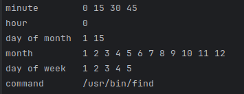

# Cron Expression Parser

This application parses a cron string and expands each field to show the times at which it will run. It is implemented in Java and provides a clear output of each cron field.

## What is a Cron Expression?

A cron expression is a string representing a schedule. It is commonly used in Unix-like operating systems to schedule jobs (commands or scripts) to run periodically at fixed times, dates, or intervals. The cron expression consists of five or six fields separated by spaces, where each field represents a different time unit.

### Fields Explained:

1. **Minute (0 - 59)**:
   - Specifies the minute(s) at which the command should run.
   - `*` means every minute.
   - `*/15` means every 15 minutes.

2. **Hour (0 - 23)**:
   - Specifies the hour(s) at which the command should run.
   - `0` means midnight.

3. **Day of Month (1 - 31)**:
   - Specifies the day(s) of the month on which the command should run.
   - `1,15` means the command will run on the 1st and 15th of the month.

4. **Month (1 - 12)**:
   - Specifies the month(s) during which the command should run.
   - `*` means every month.

5. **Day of Week (0 - 7)**:
   - Specifies the day(s) of the week on which the command should run.
   - `1-5` means Monday through Friday (0 and 7 both represent Sunday).

6. **Command**:
   - The command to be executed.

### Example Cron Expression:

Given the cron expression `*/15 0 1,15 * 1-5`:

- **Minute**: `*/15`
   - The command runs every 15 minutes (0, 15, 30, 45).

- **Hour**: `0`
   - The command runs at midnight (00:00).

- **Day of Month**: `1,15`
   - The command runs on the 1st and 15th of each month.

- **Month**: `*`
   - The command runs every month.

- **Day of Week**: `1-5`
   - The command runs from Monday to Friday.

### Complete Command:

The complete cron expression `*/15 0 1,15 * 1-5` specifies that the command runs every 15 minutes at midnight on the 1st and 15th of each month, and only on Monday through Friday.

## Usage

1. **Navigate to the project directory**:
    ```sh
    cd /path/to/project/src/main/java/pl
    ```

2. **Compile the Java files**:
    ```sh
    javac pl/CronParser.java
    ```

3. **Run the program**:
    ```sh
    java pl.CronParser "*/15 0 1,15 * 1-5 /usr/bin/find"
    ```

## Example Output

Given the following cron expression:
```sh
*/15 0 1,15 * 1-5 /usr/bin/find
```


## How It Works

### Main Process

1. **Input Handling**:
   - The program expects a single argument, which is the cron expression. If the number of arguments is not equal to one, it prints a usage message and exits.

2. **Parsing the Cron Expression**:
   - The cron expression is split into six parts: minute, hour, day of month, month, day of week, and command.
   - Each part is then processed to expand its values.

3. **Expanding Each Field**:
   - The `expandField` method processes each field according to its type (minute, hour, etc.). It uses helper methods to handle different types of values (ranges, lists, steps, and individual values).

### Detailed Methods

1. **expandField**:
   - Determines the type of value (e.g., `*`, `,`, `-`, `/`) and delegates to the appropriate helper method.
   - Uses the `CronFieldType` enum to get the valid range and names for the field.

2. **handleSingleValue**:
   - Handles individual values, either mapping named values to their numeric equivalents or validating numeric values.

3. **validateNumericField**:
   - Ensures a numeric value is within the valid range for the field.

4. **rangeToString** and **range**:
   - Converts a range of numbers to a space-separated string.

5. **expandStep**:
   - Expands values specified with a step (e.g., `*/15`).

6. **expandList**:
   - Expands comma-separated lists of values.

7. **expandRange**:
   - Expands ranges of values (e.g., `1-5`).

### Enums

**CronFieldType**:
   - Defines the valid ranges and names for each cron field type (minute, hour, day of month, month, day of week).

## Summary

This project demonstrates how to parse and expand cron expressions to show the specific times at which a command will run. By understanding the structure of cron expressions and using Java to process and expand these values, we can create a detailed schedule for any cron job.


### Using JaCoCo for Code Coverage

This project uses JaCoCo for code coverage. To generate a code coverage report with Maven, follow these steps:

1. **Run Tests with Maven**:
    ```sh
    mvn clean test
    ```

2. **Generate the JaCoCo Report**:
    ```sh
    mvn jacoco:report
    ```

3. **View the Report**:
   Open `target/site/jacoco/index.html` in a web browser to view the detailed coverage report.

